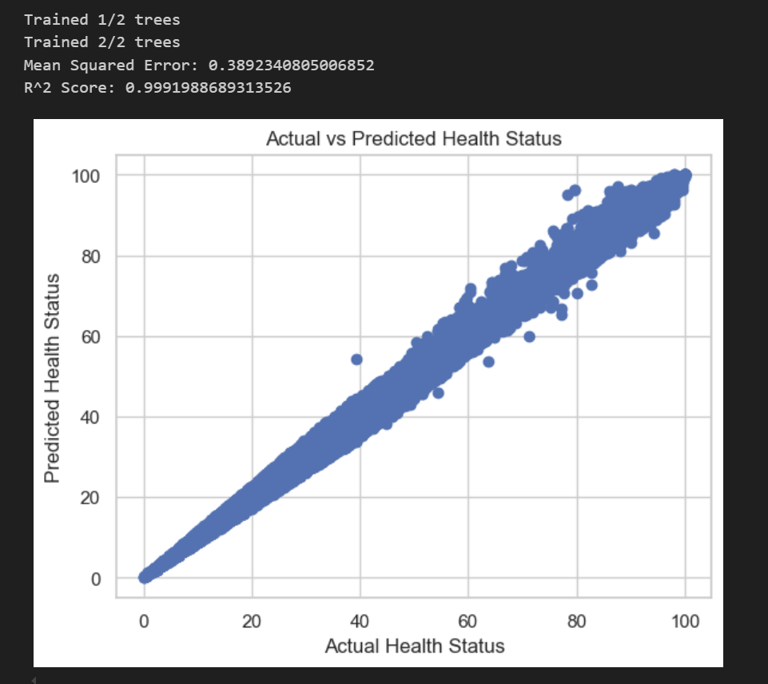
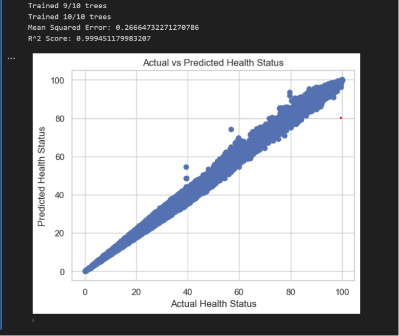
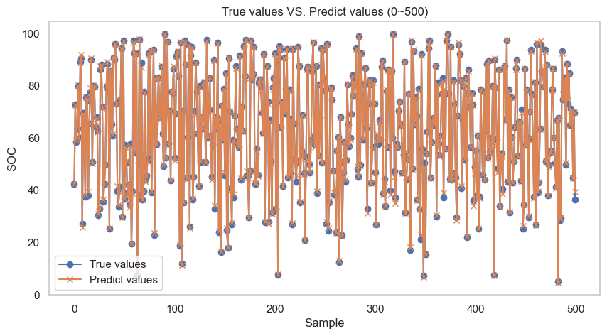
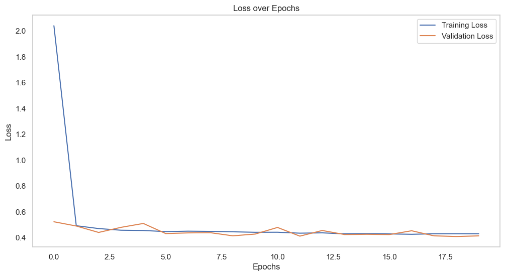
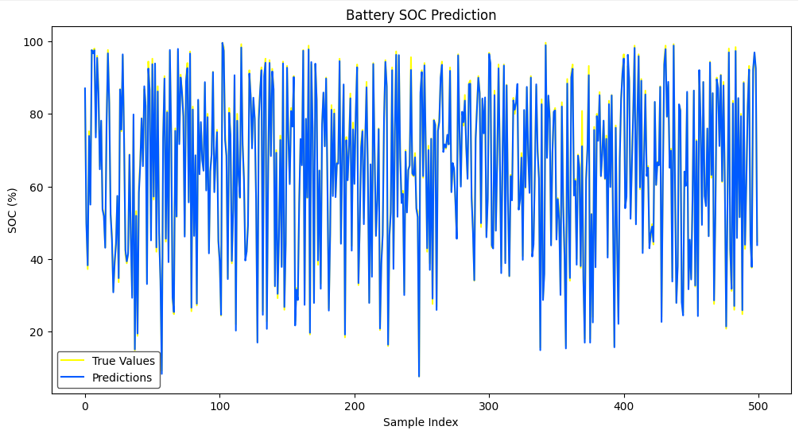
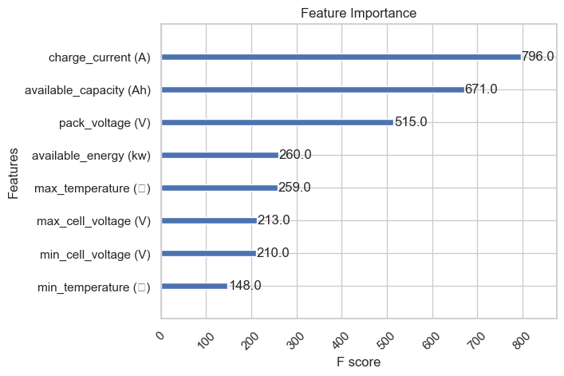
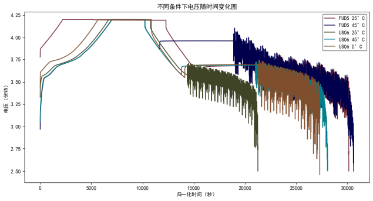
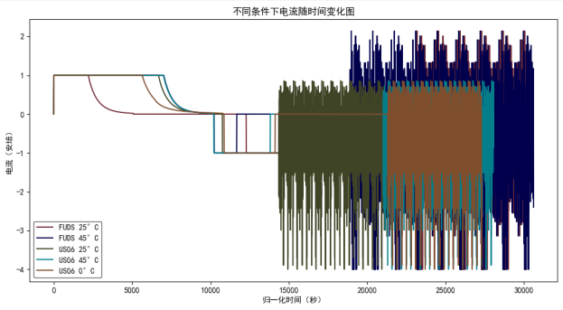
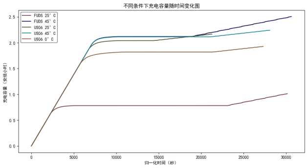
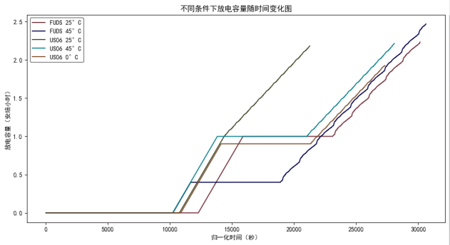

# Lithium Battery Health Analysis

## 研究1：新能源车电池

### 数据背景

新能源车电池模组的充放电数据是指电池在使用过程中进行充电和放电时所记录的相关信息。这些数据包含了电池的性能指标、工作状态和使用情况，可以帮助监测和评估电池的健康状况、性能表现以及寿命预测。这些数据通过车辆的电池管理系统（Battery Management System，简称BMS）进行监测和记录。基于这些数据，制造商和维护人员可以进行电池性能分析、故障诊断以及优化电池使用和充电策略。同时，这些数据也可以用于研究和改进电池技术，提高新能源车的续航里程和可靠性。数据可在百度网盘中下载：https://pan.baidu.com/s/1wkIS_Nm_YPZ7HD8u5oBKpQ?pwd=dynj 提取码: dynj

### 数据说明

共20辆新能源车的电池模组充放电数据，每个#x代表一辆新能源车电池模组的充放电数据，数据时间段为2019/07/25—2021/11/15，数据跨度约29个月，数据集大小约1.1GB。每个csv数据表包含10个数据字段。

| 字段名称            | 描述                     | 单位  |  
|---------------------|--------------------------|-------|  
| record_time         | 时间戳                  |       |  
| soc                 | 车辆电池剩余容量        | %     |  
| pack_voltage        | 电池模组电压            | V     |  
| charge_current      | 充电电流                | A     |  
| max_cell_voltage    | 电池单体最大电压        | V     |  
| min_cell_voltage    | 电池单体最小电压        | V     |  
| max_temperature     | 最高温度                | ℃     |  
| min_temperature     | 最低温度                | ℃     |  
| available_energy    | 可用能量                | kW    |  
| available_capacity   | 可用容量                | Ah    |

### 模型1：随机森林模型

随机森林模型是一种强大的集成学习方法，因其高效、鲁棒和可解释的特性，广泛应用于多种预测任务中。它通过构建多个决策树并进行集成，通常能显著提高预测精度，尤其在处理复杂数据时表现出色。随机森林能够有效处理具有大特征变异的高维数据，并对异常值和噪声数据具有较强的鲁棒性。此外，模型提供的特征重要性评估机制有助于识别影响系统性能的关键因素，并支持自动化特征选择，从而减少模型复杂性。其适应动态数据的能力以及良好的缺失数据处理机制，使其在众多领域成为重要工具。

> 结果1：随机森林预测值与真实值的散点图（Epoch=2）
> 
> 

> 结果2：随机森林预测值与真实值的散点图（Epoch=10）
> 
> 

Epoch为2时，均方误差 (MSE) 较高，为0.3892，表明模型在预测中的误差相对较大。较大的MSE意味着预测值与真实值之间存在明显的偏差。R² Score 接近1，为0.99919，表明模型的预测效果非常好。大部分的变异得到了模型的解释，说明模型基本上能够很好地捕捉数据的趋势。整体趋势较为显著，预测值几乎与实际值成线性关系，但存在一些较远离主对角线的点，说明存在少数异常情况。

Epoch为10时，均方误差显著降低，为0.2666，表明模型的预测误差有所减小，整体预测精度得到了提高。R² Score 相较于先前的图像有所下降，但仍然非常接近1，为0.9945，表明模型依旧具有很好的预测能力。在此图中，所有点更为集中于主对角线上，显示出预测效果比第一次更为准确，异常点的数量明显减少，表明模型对数据的拟合更加优化。

从MSE和R²的变化来看，Epoch为10时模型的表现要优于Epoch为2。这表明随着模型训练的次数增多，模型的学习能力和准确性得到了提升。

### 模型2：神经网络模型

神经网络是受生物神经系统启发的一类计算模型，具有较强的学习和表达能力。神经网络通过模拟大脑神经元之间的连接来处理信息，特别适用于处理复杂的非线性关系。其核心思想是通过训练大量的节点（神经元）来构建一个能够从输入到输出之间学习复杂映射的模型。

在本任务中，我们使用神经网络模型来预测电池健康状态，模型的输入为电池的各种运行特征，输出为电池的健康状态，通常以剩余容量或健康指数表示。神经网络的优势在于其能够从数据中自动学习特征之间的复杂关系，而无需手动选择或设计特征。

> 结果1：神经网络模型的预测值和真实值曲线（0~500）
> 
> 

> 结果2：神经网络模型的损失值曲线
> 
> 

测试的结果中，测试集的准确率为0.999096.

训练损失 (Training Loss) 和 验证损失 (Validation Loss) 随时间（Epochs）的变化趋势较为平稳。在训练的最开始阶段，训练损失显著下降，表明模型在学习并拟合训练数据。二者在最终阶段趋于稳定，且训练损失略低于验证损失，说明模型已经收敛，且未出现过拟合的严重现象。损失值维持在0.4上下，表明模型整体表现良好，预测效果较为准确。

蓝色（真实值）与橙色（预测值）的数据点在整个范围内都有相对密集的重叠，显示出模型能够较好地贴合真实值。

### 模型3：RNN

递归神经网络（RNN）是一类用于处理序列数据的神经网络模型，其通过“记忆”之前时间步骤的信息来进行当前时间步骤的预测或决策。与传统的前馈神经网络不同，RNN具有内部循环结构，可以有效地捕捉输入数据之间的时序依赖关系。RNN特别适用于需要考虑过去信息的任务，如语言模型、时间序列预测、语音识别等。

在锂电池健康状态预测中，RNN因其在时间序列建模中的卓越能力而表现出重要价值。锂电池的性能指标（如容量、内阻、放电效率等）随时间变化，具有强烈的时间依赖性。通过将充放电循环的历史数据输入RNN，模型能够学习到电池退化的时序模式，从而对未来的状态做出更精准的预测。

> 

测试的结果中，测试集的准确率为0.998297. 整体拟合效果很好。

### 模型4：XGBoost

作为一种高效的机器学习算法，XGBoost采用梯度提升的框架，通过迭代地训练决策树来构建模型。在每一轮迭代中，XGBoost会拟合前一轮预测的残差，以此来减少损失函数。算法中加入了L1和L2正则化项来控制模型复杂度，防止过拟合。XGBoost还支持并行计算，能够自动处理缺失值，并且允许用户自定义目标函数和评估标准，使其适用于多种机器学习任务。此外，XGBoost提供了特征重要性评估，增强了模型的可解释性。这些特点使得XGBoost在处理汽车锂电池数据时，能够准确地预测电池性能和寿命，同时提供对模型决策过程的深入理解。XGBoost通过不断增加新树来最小化目标函数。该过程可描述为以下几个步骤：
- 初始化模型：首先，模型通过常数值（例如目标值的平均数）初始化。
- 计算残差：每次迭代时，模型计算当前预测与实际标签之间的误差（残差）。
- 拟合残差：新的一棵树拟合当前残差，并生成预测结果。
- 加权更新：每棵树的输出都根据一个学习率进行加权，模型将新树的预测结果加到之前的预测上。
- 重复迭代：以上步骤重复进行，直到达到预定的迭代次数或满足停止条件。

> XGBoost模型的特征重要性图
> 
> 

XGBoost在测试集上的预测准确率为0.998461.

图中列出了8个特征，主要包括电流（charge_current）、容量（available_capacity）、电压（pack_voltage），以及温度相关特征等。F分数是用来衡量各特征对模型贡献的重要性。数值越高，表示该特征在预测中越重要。charge_current (A)：重要性最高，F分数为796，说明它对模型的预测最有影响。available_capacity (Ah)：次重要，F分数为671，表明它也对模型有显著贡献。pack_voltage (V)：F分数为515，排名第三。其余特征（如available_energy、max_temperature、max_cell_voltage等）重要性逐渐降低，最不重要的特征是min_temperature，F分数为148。

特征的重要性从“charge_current”到“min_temperature”呈现出递减的趋势，表明在这套模型中，电流和容量相关特征更为关键，温度特征的重要性相对较低。

## 研究2：单因素分析

### 数据背景

在本研究中，我们使用了FUDS和US06两种驾驶循环下的锂电池数据，来自于两个公司的锂电池，分别在不同温度条件下（0°C、25°C和45°C）进行了测试。电池型号为INR 18650-20R，容量为2000 mAh，采用LiNiMnCo/石墨电池化学成分，电池外形为圆柱形，直径为18.33毫米，长度为64.85毫米，重量约为45克（不包括安全电路）。这些电池数据用于锂电池管理系统（BMS）的状态估算与性能评估，特别是在电池状态的SOC（荷电状态）估算、健康状况评估和电池寿命预测等方面。[1]

| 特征名称                     | 描述                                      |  
|------------------------------|-------------------------------------------|  
| Data_Point                   | 每个数据点的唯一标识符。                  |  
| Test_Time(s)                 | 自测试开始以来经过的总时间（秒）。        |  
| Date_Time                    | 记录数据点的日期和时间。                  |  
| Step_Time(s)                 | 当前测试步骤中经过的时间（秒）。          |  
| Step_Index                   | 当前测试步骤的索引。                      |  
| Cycle_Index                  | 当前测试周期的索引。                      |  
| Current(A)                   | 电池中的电流（安培）。                    |  
| Voltage(V)                   | 电池的电压（伏特）。                      |  
| Charge_Capacity(Ah)         | 电池的累积充电容量（安培小时）。          |  
| Discharge_Capacity(Ah)      | 电池的累积放电容量（安培小时）。          |  
| Charge_Energy(Wh)           | 电池的累积充电能量（瓦特小时）。          |  
| Discharge_Energy(Wh)        | 电池的累积放电能量（瓦特小时）。          |  
| dV/dt(V/s)                  | 电压随时间变化的速率（伏特每秒）。        |  
| Internal_Resistance(Ohm)    | 电池的内阻（欧姆）。                      |  
| Is_FC_Data                   | 标志是否为完全充电（FC）周期的数据点。    |  
| AC_Impedance(Ohm)           | 电池的交流阻抗（欧姆）。                  |  
| ACI_Phase_Angle(Deg)        | 交流阻抗的相位角（度）。                  |

### 数据分析

这四个图表分别展示了不同条件下锂电池的电压、电流、充电容量、放电容量随时间的变化。

1. 电压随时间变化图

图中展示了不同品牌（FUDS和US06）电池在不同温度（25°C、45°C和0°C）下的电压变化情况。整体来看，电压随着时间的推移表现出明显的特征，尤其是在充电和放电阶段。在充电初期，电压迅速上升，接近4.2V的充电上限。这一现象在所有温度下均有体现，表明电池在充电过程中能够有效地积累电能。在接近充电上限时（约4.2V），电压保持在一个相对稳定的水平，期间电流逐渐降低。这一阶段显示了电池的充电过程已经进入了恒压状态。

在放电阶段，电压快速下降，尤其是在高温（45°C）和低温（0°C）下，电压下降的幅度和速率有所不同。在25°C下，电压下降较为平稳，显示出良好的放电性能。在45°C下，电压在初期迅速下降，随后出现波动，可能是由于高温导致的内阻增加或电池化学反应不稳定。在0°C下，电压的下降速率明显减缓，且整体电压水平较低，这反映出低温对电池放电性能的抑制作用。
FUDS电池在各温度下的电压变化较为稳定，尤其在25°C时表现出较好的放电特性。US06电池在高温条件下的电压波动较大，显示出在高温环境下的稳定性不足。在低温下，US06电池的电压水平明显低于FUDS品牌，进一步验证了低温对电池性能的影响。

2. 电流随时间变化图

在充电初期，电流迅速上升，达到设定的充电电流值。这一现象在所有温度下均有体现，显示电池在充电时能够有效吸收电流。随着充电的进行，尤其在接近充电上限（如4.2V）时，电流逐渐下降，表明电池进入了恒压充电阶段。

在放电阶段，电流的变化较为复杂，尤其在高温（45°C）和低温（0°C）下，电流波动显著。在25°C下，电流的波动相对较小，显示出良好的放电性能。在45°C下，电流波动较大，可能是由于高温导致的内阻变化或电池化学反应的不稳定性。在0°C下，电流的波动幅度也较小，且整体电流水平较低，反映出低温对电池放电能力的抑制。

FUDS电池在不同温度下的电流变化较为一致，尤其在25°C时表现出稳定的充放电特性。US06电池在高温条件下的电流波动较大，显示出在高温环境下的稳定性不足。在低温下，US06电池的电流水平也显著低于FUDS品牌，进一步验证了低温对电池性能的影响。

3. 充电容量随时间变化图

FUDS电池在25°C下表现出最佳的充电容量增长，容量在较短时间内迅速提升，并在接近充电上限时趋于平稳，显示出良好的充电效率。US06电池在此温度下的充电容量增长也较为良好，但略低于FUDS品牌。在高温条件下，FUDS电池的充电容量增长出现了明显的波动，尤其是在充电后期，可能是由于高温导致的电池内部化学反应不稳定。US06电池在45°C下的充电容量增长较慢，且在达到一定容量后增长趋于平稳，表明高温环境对其性能产生了负面影响。在低温下，两个品牌的充电容量都显著降低，且充电过程中的容量增长速度明显减缓。FUDS电池的表现相对较好，但整体容量仍然低于其他温度条件下的表现。US06电池在0°C下的充电容量增长非常缓慢，显示出低温对电池充电性能的显著抑制。

在所有温度下，FUDS电池的充电容量表现出较好的增长趋势，尤其在常温下，其充电效率最高。US06电池在高温和低温条件下的表现不如FUDS，尤其在45°C和0°C时，充电容量的增长明显受限。

4. 放电容量随时间变化图

FUDS电池在25°C下的放电容量表现最佳，随着时间的推移，容量稳定上升，且在放电后期保持较高的水平，显示出良好的放电性能。US06电池在此温度下的放电容量也表现良好，但整体容量略低于FUDS。FUDS电池在高温条件下的放电容量增长出现波动，尤其在放电后期，可能是由于高温导致的内部化学反应不稳定，影响了放电效率。US06电池在45°C下的放电容量增长较慢，且在达到一定容量后趋于平稳，表明高温环境对其性能产生了负面影响。在低温下，两个品牌的放电容量均显著降低，且放电过程中的容量增长速度明显减缓。FUDS电池的表现相对较好，但整体容量仍然低于其他温度条件下的表现。US06电池在0°C下的放电容量增长非常缓慢，显示出低温对电池放电性能的显著抑制。

在所有温度下，FUDS电池的放电容量表现出较好的增长趋势，尤其在常温下，其放电效率最高。US06电池在高温和低温条件下的表现不如FUDS，尤其在45°C和0°C时，放电容量的增长明显受限。

整体来看，FUDS电池在各项指标上表现优于US06电池，尤其在常温（25°C）条件下，其充放电性能更为优异。在高温（45°C）和低温（0°C）条件下，电池性能均受到显著影响：高温可能引发内阻增加和化学反应不稳定，导致电压波动和容量下降，而低温则抑制电池的充放电能力，表现为电压和容量增长缓慢。特别是在放电阶段，FUDS电池表现出更稳定的电压和容量变化趋势，而US06电池在高温和低温下的稳定性较差，进一步突显了不同品牌电池在极端环境下的性能差异。这些分析为锂电池在不同使用条件下的性能评估和优化设计提供了重要参考。

> FUDS和US06电池在四种条件下的变化曲线图
>
> 
>
> 
>
> 
>
> 

参考

[1] 见官方网站：https://calce.umd.edu/data#CS2
