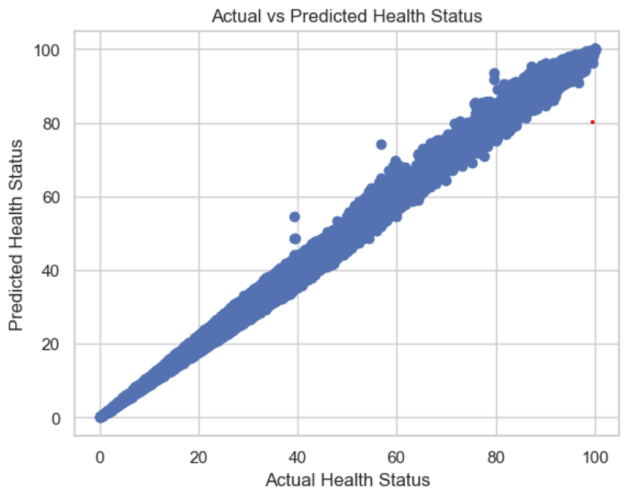

# Lithium Battery Health Analysis

## 研究1：新能源车电池

### 数据背景

新能源车电池模组的充放电数据是指电池在使用过程中进行充电和放电时所记录的相关信息。这些数据包含了电池的性能指标、工作状态和使用情况，可以帮助监测和评估电池的健康状况、性能表现以及寿命预测。这些数据通过车辆的电池管理系统（Battery Management System，简称BMS）进行监测和记录。基于这些数据，制造商和维护人员可以进行电池性能分析、故障诊断以及优化电池使用和充电策略。同时，这些数据也可以用于研究和改进电池技术，提高新能源车的续航里程和可靠性。数据可在百度网盘中下载：https://pan.baidu.com/s/1wkIS_Nm_YPZ7HD8u5oBKpQ?pwd=dynj 提取码: dynj

### 数据说明

共20辆新能源车的电池模组充放电数据，每个#x代表一辆新能源车电池模组的充放电数据，数据时间段为2019/07/25—2021/11/15，数据跨度约29个月，数据集大小约1.1GB。每个csv数据表包含10个数据字段。

| 字段名称            | 描述                     | 单位  |  
|---------------------|--------------------------|-------|  
| record_time         | 时间戳                  |       |  
| soc                 | 车辆电池剩余容量        | %     |  
| pack_voltage        | 电池模组电压            | V     |  
| charge_current      | 充电电流                | A     |  
| max_cell_voltage    | 电池单体最大电压        | V     |  
| min_cell_voltage    | 电池单体最小电压        | V     |  
| max_temperature     | 最高温度                | ℃     |  
| min_temperature     | 最低温度                | ℃     |  
| available_energy    | 可用能量                | kW    |  
| available_capacity   | 可用容量                | Ah    |

### 模型1：随机森林模型

随机森林模型是一种强大的集成学习方法，因其高效、鲁棒和可解释的特性，广泛应用于多种预测任务中。它通过构建多个决策树并进行集成，通常能显著提高预测精度，尤其在处理复杂数据时表现出色。随机森林能够有效处理具有大特征变异的高维数据，并对异常值和噪声数据具有较强的鲁棒性。此外，模型提供的特征重要性评估机制有助于识别影响系统性能的关键因素，并支持自动化特征选择，从而减少模型复杂性。其适应动态数据的能力以及良好的缺失数据处理机制，使其在众多领域成为重要工具。

> 结果1：随机森林预测值与真实值的散点图（Epoch=2）
> 
> 

> 结果2：随机森林预测值与真实值的散点图（Epoch=10）
> 
> 

Epoch为2时，均方误差 (MSE) 较高，为0.3892，表明模型在预测中的误差相对较大。较大的MSE意味着预测值与真实值之间存在明显的偏差。R² Score 接近1，为0.99919，表明模型的预测效果非常好。大部分的变异得到了模型的解释，说明模型基本上能够很好地捕捉数据的趋势。整体趋势较为显著，预测值几乎与实际值成线性关系，但存在一些较远离主对角线的点，说明存在少数异常情况。

Epoch为10时，均方误差显著降低，为0.2666，表明模型的预测误差有所减小，整体预测精度得到了提高。R² Score 相较于先前的图像有所下降，但仍然非常接近1，为0.9945，表明模型依旧具有很好的预测能力。在此图中，所有点更为集中于主对角线上，显示出预测效果比第一次更为准确，异常点的数量明显减少，表明模型对数据的拟合更加优化。

从MSE和R²的变化来看，Epoch为10时模型的表现要优于Epoch为2。这表明随着模型训练的次数增多，模型的学习能力和准确性得到了提升。

### 模型2：神经网络模型

神经网络是受生物神经系统启发的一类计算模型，具有较强的学习和表达能力。神经网络通过模拟大脑神经元之间的连接来处理信息，特别适用于处理复杂的非线性关系。其核心思想是通过训练大量的节点（神经元）来构建一个能够从输入到输出之间学习复杂映射的模型。

在本任务中，我们使用神经网络模型来预测电池健康状态，模型的输入为电池的各种运行特征，输出为电池的健康状态，通常以剩余容量或健康指数表示。神经网络的优势在于其能够从数据中自动学习特征之间的复杂关系，而无需手动选择或设计特征。

> 结果1：神经网络模型的预测值和真实值曲线（0~500）
> 
> 

> 结果2：神经网络模型的损失值曲线
> 
> 

测试的结果中，测试集的准确率为0.999096.

训练损失 (Training Loss) 和 验证损失 (Validation Loss) 随时间（Epochs）的变化趋势较为平稳。在训练的最开始阶段，训练损失显著下降，表明模型在学习并拟合训练数据。二者在最终阶段趋于稳定，且训练损失略低于验证损失，说明模型已经收敛，且未出现过拟合的严重现象。损失值维持在0.4上下，表明模型整体表现良好，预测效果较为准确。

蓝色（真实值）与橙色（预测值）的数据点在整个范围内都有相对密集的重叠，显示出模型能够较好地贴合真实值。

### 模型3：RNN

递归神经网络（RNN）是一类用于处理序列数据的神经网络模型，其通过“记忆”之前时间步骤的信息来进行当前时间步骤的预测或决策。与传统的前馈神经网络不同，RNN具有内部循环结构，可以有效地捕捉输入数据之间的时序依赖关系。RNN特别适用于需要考虑过去信息的任务，如语言模型、时间序列预测、语音识别等。

在锂电池健康状态预测中，RNN因其在时间序列建模中的卓越能力而表现出重要价值。锂电池的性能指标（如容量、内阻、放电效率等）随时间变化，具有强烈的时间依赖性。通过将充放电循环的历史数据输入RNN，模型能够学习到电池退化的时序模式，从而对未来的状态做出更精准的预测。

> 

测试的结果中，测试集的准确率为0.998297. 整体拟合效果很好。

### 模型4：XGBoost

作为一种高效的机器学习算法，XGBoost采用梯度提升的框架，通过迭代地训练决策树来构建模型。在每一轮迭代中，XGBoost会拟合前一轮预测的残差，以此来减少损失函数。算法中加入了L1和L2正则化项来控制模型复杂度，防止过拟合。XGBoost还支持并行计算，能够自动处理缺失值，并且允许用户自定义目标函数和评估标准，使其适用于多种机器学习任务。此外，XGBoost提供了特征重要性评估，增强了模型的可解释性。这些特点使得XGBoost在处理汽车锂电池数据时，能够准确地预测电池性能和寿命，同时提供对模型决策过程的深入理解。XGBoost通过不断增加新树来最小化目标函数。该过程可描述为以下几个步骤：
- 初始化模型：首先，模型通过常数值（例如目标值的平均数）初始化。
- 计算残差：每次迭代时，模型计算当前预测与实际标签之间的误差（残差）。
- 拟合残差：新的一棵树拟合当前残差，并生成预测结果。
- 加权更新：每棵树的输出都根据一个学习率进行加权，模型将新树的预测结果加到之前的预测上。
- 重复迭代：以上步骤重复进行，直到达到预定的迭代次数或满足停止条件。

> XGBoost模型的特征重要性图
> 
> 

XGBoost在测试集上的预测准确率为0.998461.

图中列出了8个特征，主要包括电流（charge_current）、容量（available_capacity）、电压（pack_voltage），以及温度相关特征等。F分数是用来衡量各特征对模型贡献的重要性。数值越高，表示该特征在预测中越重要。charge_current (A)：重要性最高，F分数为796，说明它对模型的预测最有影响。available_capacity (Ah)：次重要，F分数为671，表明它也对模型有显著贡献。pack_voltage (V)：F分数为515，排名第三。其余特征（如available_energy、max_temperature、max_cell_voltage等）重要性逐渐降低，最不重要的特征是min_temperature，F分数为148。

特征的重要性从“charge_current”到“min_temperature”呈现出递减的趋势，表明在这套模型中，电流和容量相关特征更为关键，温度特征的重要性相对较低。

## 研究2：单因素分析

### 数据背景

在本研究中，我们使用了FUDS和US06两种驾驶循环下的锂电池数据，来自于两个公司的锂电池，分别在不同温度条件下（0°C、25°C和45°C）进行了测试。电池型号为INR 18650-20R，容量为2000 mAh，采用LiNiMnCo/石墨电池化学成分，电池外形为圆柱形，直径为18.33毫米，长度为64.85毫米，重量约为45克（不包括安全电路）。这些电池数据用于锂电池管理系统（BMS）的状态估算与性能评估，特别是在电池状态的SOC（荷电状态）估算、健康状况评估和电池寿命预测等方面。[1]

| 特征名称                     | 描述                                      |  
|------------------------------|-------------------------------------------|  
| Data_Point                   | 每个数据点的唯一标识符。                  |  
| Test_Time(s)                 | 自测试开始以来经过的总时间（秒）。        |  
| Date_Time                    | 记录数据点的日期和时间。                  |  
| Step_Time(s)                 | 当前测试步骤中经过的时间（秒）。          |  
| Step_Index                   | 当前测试步骤的索引。                      |  
| Cycle_Index                  | 当前测试周期的索引。                      |  
| Current(A)                   | 电池中的电流（安培）。                    |  
| Voltage(V)                   | 电池的电压（伏特）。                      |  
| Charge_Capacity(Ah)         | 电池的累积充电容量（安培小时）。          |  
| Discharge_Capacity(Ah)      | 电池的累积放电容量（安培小时）。          |  
| Charge_Energy(Wh)           | 电池的累积充电能量（瓦特小时）。          |  
| Discharge_Energy(Wh)        | 电池的累积放电能量（瓦特小时）。          |  
| dV/dt(V/s)                  | 电压随时间变化的速率（伏特每秒）。        |  
| Internal_Resistance(Ohm)    | 电池的内阻（欧姆）。                      |  
| Is_FC_Data                   | 标志是否为完全充电（FC）周期的数据点。    |  
| AC_Impedance(Ohm)           | 电池的交流阻抗（欧姆）。                  |  
| ACI_Phase_Angle(Deg)        | 交流阻抗的相位角（度）。                  |

### 数据分析

这四个图表分别展示了不同条件下锂电池的电压、电流、充电容量、放电容量随时间的变化。

1. 电压随时间变化图

图中展示了不同品牌（FUDS和US06）电池在不同温度（25°C、45°C和0°C）下的电压变化情况。整体来看，电压随着时间的推移表现出明显的特征，尤其是在充电和放电阶段。在充电初期，电压迅速上升，接近4.2V的充电上限。这一现象在所有温度下均有体现，表明电池在充电过程中能够有效地积累电能。在接近充电上限时（约4.2V），电压保持在一个相对稳定的水平，期间电流逐渐降低。这一阶段显示了电池的充电过程已经进入了恒压状态。

在放电阶段，电压快速下降，尤其是在高温（45°C）和低温（0°C）下，电压下降的幅度和速率有所不同。在25°C下，电压下降较为平稳，显示出良好的放电性能。在45°C下，电压在初期迅速下降，随后出现波动，可能是由于高温导致的内阻增加或电池化学反应不稳定。在0°C下，电压的下降速率明显减缓，且整体电压水平较低，这反映出低温对电池放电性能的抑制作用。
FUDS电池在各温度下的电压变化较为稳定，尤其在25°C时表现出较好的放电特性。US06电池在高温条件下的电压波动较大，显示出在高温环境下的稳定性不足。在低温下，US06电池的电压水平明显低于FUDS品牌，进一步验证了低温对电池性能的影响。

2. 电流随时间变化图

在充电初期，电流迅速上升，达到设定的充电电流值。这一现象在所有温度下均有体现，显示电池在充电时能够有效吸收电流。随着充电的进行，尤其在接近充电上限（如4.2V）时，电流逐渐下降，表明电池进入了恒压充电阶段。

在放电阶段，电流的变化较为复杂，尤其在高温（45°C）和低温（0°C）下，电流波动显著。在25°C下，电流的波动相对较小，显示出良好的放电性能。在45°C下，电流波动较大，可能是由于高温导致的内阻变化或电池化学反应的不稳定性。在0°C下，电流的波动幅度也较小，且整体电流水平较低，反映出低温对电池放电能力的抑制。

FUDS电池在不同温度下的电流变化较为一致，尤其在25°C时表现出稳定的充放电特性。US06电池在高温条件下的电流波动较大，显示出在高温环境下的稳定性不足。在低温下，US06电池的电流水平也显著低于FUDS品牌，进一步验证了低温对电池性能的影响。

3. 充电容量随时间变化图

FUDS电池在25°C下表现出最佳的充电容量增长，容量在较短时间内迅速提升，并在接近充电上限时趋于平稳，显示出良好的充电效率。US06电池在此温度下的充电容量增长也较为良好，但略低于FUDS品牌。在高温条件下，FUDS电池的充电容量增长出现了明显的波动，尤其是在充电后期，可能是由于高温导致的电池内部化学反应不稳定。US06电池在45°C下的充电容量增长较慢，且在达到一定容量后增长趋于平稳，表明高温环境对其性能产生了负面影响。在低温下，两个品牌的充电容量都显著降低，且充电过程中的容量增长速度明显减缓。FUDS电池的表现相对较好，但整体容量仍然低于其他温度条件下的表现。US06电池在0°C下的充电容量增长非常缓慢，显示出低温对电池充电性能的显著抑制。

在所有温度下，FUDS电池的充电容量表现出较好的增长趋势，尤其在常温下，其充电效率最高。US06电池在高温和低温条件下的表现不如FUDS，尤其在45°C和0°C时，充电容量的增长明显受限。

4. 放电容量随时间变化图

FUDS电池在25°C下的放电容量表现最佳，随着时间的推移，容量稳定上升，且在放电后期保持较高的水平，显示出良好的放电性能。US06电池在此温度下的放电容量也表现良好，但整体容量略低于FUDS。FUDS电池在高温条件下的放电容量增长出现波动，尤其在放电后期，可能是由于高温导致的内部化学反应不稳定，影响了放电效率。US06电池在45°C下的放电容量增长较慢，且在达到一定容量后趋于平稳，表明高温环境对其性能产生了负面影响。在低温下，两个品牌的放电容量均显著降低，且放电过程中的容量增长速度明显减缓。FUDS电池的表现相对较好，但整体容量仍然低于其他温度条件下的表现。US06电池在0°C下的放电容量增长非常缓慢，显示出低温对电池放电性能的显著抑制。

在所有温度下，FUDS电池的放电容量表现出较好的增长趋势，尤其在常温下，其放电效率最高。US06电池在高温和低温条件下的表现不如FUDS，尤其在45°C和0°C时，放电容量的增长明显受限。

整体来看，FUDS电池在各项指标上表现优于US06电池，尤其在常温（25°C）条件下，其充放电性能更为优异。在高温（45°C）和低温（0°C）条件下，电池性能均受到显著影响：高温可能引发内阻增加和化学反应不稳定，导致电压波动和容量下降，而低温则抑制电池的充放电能力，表现为电压和容量增长缓慢。特别是在放电阶段，FUDS电池表现出更稳定的电压和容量变化趋势，而US06电池在高温和低温下的稳定性较差，进一步突显了不同品牌电池在极端环境下的性能差异。这些分析为锂电池在不同使用条件下的性能评估和优化设计提供了重要参考。

> FUDS和US06电池在四种条件下的变化曲线图
>
> 
>
> 
>
> 
>
> 

## 研究3：棱柱形锂电池[2]

### 数据集介绍

研究2使用了CALCE（Center for Advanced Life Cycle Engineering）提供的锂电池数据集，旨在通过分析不同充放电条件下锂电池的性能变化，深入探讨电池健康状态（SoH）和剩余寿命（RUL）的预测方法。该数据集包含了多种类型的锂电池单体数据，具体包括 CS2_35, CS2_36, CS2_37, CS2_38 等多个电池样本，每个样本在不同的循环条件下进行测试。

所有电池均为棱柱形电池（Prismatic Cells），其具体规格如下：容量等级：1100 mAh；电池化学成分：正极材料为LiCoO2，EDS分析还显示有少量的锰元素；重量（不含安全电路）：21.1 g；尺寸：5.4 x 33.6 x 50.6 mm

所有CS2系列电池均按照相同的充电标准进行充电，采用恒流/恒压充电模式，充电速率为0.5°C，直到电池电压达到4.2V，并保持4.2V直至充电电流下降至低于0.05A为止。在放电方面，除非特别说明，否则所有电池的放电截止电压为2.7V。

数据集中的电池名称遵循命名规则：“CS2_n”，其中n代表电池编号。每个电池进行了多次循环测试，测试数据以Excel格式记录，并按照测试日期命名文件。大部分电池（除CS2_8和CS2_21外）使用Arbin电池测试仪进行测试，CS2_8和CS2_21则使用CADEX电池测试仪，且其数据以.txt格式提供下载。

| 字段名称                     | 描述                                                         |  
|----------------------------|------------------------------------------------------------|  
| Data_Point                 | 数据点的唯一标识符，通常用于区分不同的记录。                         |  
| Test_Time(s)               | 测试时间，以秒为单位，指测试开始后的时间。                          |  
| Date_Time                  | 记录的日期和时间，通常是数据采集的具体时间。                       |  
| Step_Time(s)               | 步骤时间，以秒为单位，可能表示在特定测试步骤中经过的时间。             |  
| Step_Index                 | 步骤索引，标识当前记录所处的测试步骤。                             |  
| Cycle_Index                | 循环索引，表示电池的充放电循环次数。                               |  
| Current(A)                 | 电流，单位为安培，表示电池在测试过程中所经历的电流值。                 |  
| Voltage(V)                 | 电压，单位为伏特，表示电池在测试过程中的电压。                       |  
| Charge_Capacity(Ah)        | 充电容量，单位为安时，表示电池充电时能够存储的电量。                  |  
| Discharge_Capacity(Ah)     | 放电容量，单位为安时，表示电池放电时释放的电量。                     |  
| Charge_Energy(Wh)          | 充电能量，单位为瓦特时，表示充电过程中消耗的能量。                   |  
| Discharge_Energy(Wh)       | 放电能量，单位为瓦特时，表示放电过程中释放的能量。                   |  
| dV/dt(V/s)                | 电压变化率，以伏特每秒为单位，表示电压随时间变化的速率。               |  
| Internal_Resistance(Ohm)   | 内阻，单位为欧姆，表示电池内部的电阻，对电池的性能和效率有影响。       |  
| Is_FC_Data                 | 是否为燃料电池数据的标识，通常为布尔值（是/否）。                    |  
| AC_Impedance(Ohm)          | 交流阻抗，单位为欧姆，表示电池对交流信号的阻抗。                     |  
| ACI_Phase_Angle(Deg)       | 交流阻抗的相位角，以度为单位，表示电池在交流信号下的相位响应。         |

### 测试条件

- 温度：测试温度 1 度
- 充电：以的恒定电流（CC）模式进行充电，直到电池电压达到 4.2V，然后以恒定电压（CV）模式充电，直到充电电流降至 20mA。
- 放电：以恒定电流（CC）模式进行放电，直到电池电压降到 2.7V。
- 终止条件：当电池达到寿命终止（End Of Life, EOF）标准——额定容量下降到它的30%，即电池的额定容量从 1.1Ahr 到 0.77Ahr。

### 数据读取与预处理

我们首先定义了电池名称列表和数据集的路径，并创建了一个字典来存储每个电池的分析结果。通过遍历电池名称，我们使用glob函数获取每个电池目录下的所有 Excel 文件，并从中读取数据。提取文件的日期信息后，我们对其进行排序，初始化多个列表以存储放电容量、健康指标、内部电阻、恒流充电时间（CCCT）和恒压充电时间（CVCT）。

在处理每个文件时，我们计算放电容量和健康指标，并记录每个循环的性能数据。此外，通过调用drop_outlier函数去除异常值，确保数据的准确性。最终，所有处理后的数据被整理成 Pandas DataFrame，并存储在字典中，为后续的分析和展示提供了基础。此过程为电池性能评估提供了系统化的方法，旨在支持进一步的研究和决策。

### 数据分析

1. 放电容量 vs. 放电周期：我们对放电时的电池容量衰减曲线分析如下。

> 四种型号电池放电时的电池容量衰减曲线
> 
> 

这张图展示了在1°C环境温度下，四种不同电池（Battery_CS2_35、Battery_CS2_36、Battery_CS2_37和Battery_CS2_38）在放电循环过程中的容量退化情况。

a. 初始容量：所有电池在开始时的容量接近1 Ah，表明它们在出厂时的性能是一致的。

b. 退化趋势：随着放电循环次数的增加，所有电池的容量逐渐下降。这一趋势清楚地显示了电池在使用过程中的退化情况。

c. 各电池的表现：Battery_CS2_35（蓝色虚线）和Battery_CS2_36（绿色虚线）的容量下降速度相对较慢，表现出较好的耐用性。Battery_CS2_37（红色虚线）和Battery_CS2_38（青色虚线）的容量下降速度更快，显示出它们在循环使用中的耐用性相对较差。

d. 稳定性：在某些循环阶段，电池容量出现明显的波动，这可能与测试条件或电池本身的特性有关。

e. 循环次数与容量：到达1000个循环时，所有电池的容量普遍下降至0.4 Ah以下，反映出在长时间使用后的显著退化。

f. 大致趋势：尽管不同电池型号的退化速率有所不同，但整体上，电池的性能会随着使用循环的增加而逐渐减弱。

g. 转折点：对于电池 CS2_35，在循环次数 633 时发生了显著的退化转折点，电池容量降至 0.7881；CS2_36 的退化转折点出现在循环次数 711，容量为 0.7062；CS2_37 在循环次数 798 时发生退化，容量为 0.6235；而 CS2_38 的显著退化转折点在循环次数 781，容量为 0.6875。转折点的识别是通过在代码中加入滚动平均和变化率计算，并确定满足下降条件的首个循环次数点，从而提取出电池在某个循环次数后开始大幅并持续退化的转折点。

这张图表明，选择适合特定应用需求的电池型号是至关重要的，因其性能稳定性和耐用性可以显著影响应用的长期效果。在各电池的表现上，Battery_CS2_35 和 Battery_CS2_36 的容量下降较慢，展示了较好的耐用性，而 Battery_CS2_37 和 Battery_CS2_38 则表现出较快的容量衰退，表明其使用寿命较短。此外，部分循环阶段电池容量的波动可能与测试条件或电池本身的特性有关。

2. 放电容量和内阻变化：随着电池的充放电次数增多，电池的内阻逐渐增大。这也是电池老化的重要原因。我们分析了内阻随充放电次数增加的变化情况。

> “CS2_35”电池内阻随充放电次数变化曲线
> 
> 

从这张散点图中，我们可以观察到关于“CS2_35”电池的健康状态（SoH）随放电循环次数的变化情况。

a. 健康状态（SoH）与循环次数的关系：健康状态在放电循环的初期（约0到200个循环）保持相对稳定，数值约在0.7到0.8之间。随着循环次数的增加（超过200个循环），SoH值逐渐下降，这表明电池的性能正在退化。

b. 退化趋势：当循环次数接近800时，SoH显著下降至0.2以下。这表明电池在经历了大量的充放电循环后，其性能已大幅削弱。

c. 内阻与颜色编码：点的颜色根据内阻的不同而变化，内阻值范围在0.090到0.120 Ohm之间。从图中可以看出，内阻随着循环次数的增加而逐渐增加，尤其在后期（循环次数高于600时），这种变化尤为明显。

d. 总结：图表展示了电池在使用过程中性能与内阻之间的关系，随着时间的推移，电池的健康状态明显降低，同时内阻增加，这通常意味着电池效率下降和能量损失增大。

> 四种电池内阻随充放电次数变化曲线（添加转折点）
> 
> 

使用滑动窗口来平滑健康状态（SoH）的变化，并找出每个电池在某一时刻下降变化最为明显的点。通过使用滑动窗口方法来平滑健康状态（SoH）的变化，本研究成功识别了每个电池在特定时刻健康状态下降最为明显的点。具体而言，Battery_CS2_35在循环次数 768 时出现了显著的 SoH 下降，SoH 值降至 0.3759，变化量为 -0.0688；Battery_CS2_36在循环次数 713 时经历了 SoH 显著下降，SoH 为 0.4769，变化量为 -0.0520；Battery_CS2_37在循环次数 880 时发生了明显的 SoH 下降，SoH 为 0.2476，变化量为 -0.0474；而 Battery_CS2_38的 SoH 显著下降出现在循环次数 898，SoH 为 0.3025，变化量为 -0.0596。这些转折点标志着电池健康状态的快速衰退，并为电池剩余寿命预测提供了重要的参考数据。

3. 各项指标 v.s. 充放电周期

除了电池容量和内阻变化，恒定电流充电时间（CCCT）和恒定电压充电时间（CVCT）也是电池健康状态（SOH）评估的重要指标。

> “CS2_35”电池四个指标随充放电次数变化曲线（添加转折点）
>
> 

从这组图表中，我们可以对“CS2_35”电池的性能指标进行详细分析。

a. 容量 (Capacity)：纵轴显示容量随放电循环次数的变化。随着循环次数的增加，容量逐渐下降，尤其在600个循环后，容量的下降速度加快，最终降至约0.4 Ah，显示出电池在使用过程中的显著性能退化。

b. 内阻 (Resistance)：纵轴显示内阻变化情况。随着循环次数的增加，内阻呈现出明显上升的趋势，从约0.085 Ohm增加到接近0.125 Ohm。这表明电池在使用过程中，内阻增大可能导致效率降低和能量损耗增加。

c. CCCT (Cycle Count Capacity Test)：纵轴显示CCCT的变化。随着放电循环的增加，CCCT数据整体呈下降趋势，显示出电池在持续使用过程中的容量损失情况。特别是在600个循环后，CCCT的值显著下跌，反映了电池的性能快速衰退。

d. CVCT (Cycle Voltage Capacity Test)：纵轴显示CVCT的变化。CVCT的值在放电循环后期（600个循环之后）出现明显上升，说明电池在经过长时间的使用后，可能出现电压特性变化，这可能与其内部化学反应和结构变化有关。

e. 转折点：通过使用滑动窗口方法，识别了 CS2_35 电池在不同测试参数下数据变化最为明显的时刻。在容量方面，CS2_35 的最大变化出现在循环次数 849，容量为 0.4584，变化量为 0.1742；在内阻方面，CS2_35 的最大变化发生在循环次数 633，内阻为 0.1036，变化量为 0.0072；在充电容量充电时间（CCCT）方面，最大变化发生在循环次数 629，值为 4738.14，变化量为 4895.26；而在充电电压充电时间（CVCT）方面，最大变化出现在循环次数 711，值为 3143.21，变化量为 3324.29。这些显著的变化点为电池健康状态的监测和剩余寿命预测提供了重要的依据。

f. 总结：通过对 CS2_35 电池在不同性能指标下的分析，可以看出电池的容量、内阻、CCCT和CVCT随着放电循环的增加而发生显著变化。尤其在约600个循环后，电池的容量和CCCT显著下降，内阻和CVCT则出现较为明显的上升。这些变化表明电池在使用过程中逐渐衰退，滑动窗口方法有效识别了各项指标变化最为明显的转折点。综合来看，测试结果表明电池在长时间使用后的性能下降趋势明显，特别是在达到一定循环次数后，各项指标均出现不利变化，提示在电池管理和监测上需加强措施，以延长电池的使用寿命。

### 模型预测

1. MLP模型

a. 序列生成：锂电池容量是一个整体减小趋势的序列。我们采用一个长度为 window_size 的滑动窗口，从序列头部到尾部，每次移动 1 个数据，来截取我们需要的训练数据。比如原始序列是 [1, 2, 3, 4, 5]，window_size=3，那么 (x, y) 对应的训练数据和标签就是 ([1, 2, 3], 4)，([2, 3, 4], 5)。

b. 生成训练集和测试集：可以采用留一评估，即一个数据作为测试集，其他所有数据作为训练集。这样做比较简单。因此，我们把三组锂电池的全部数据为训练集，剩余一组数据为测试集。

> 四种电池的MLP模型拟合图（a）：CS2_35；（b）：CS2_36；（c）CS2_37；（d）：CS2_38
> 
> 

从实验结果上看，在 CALCE 这个数据集上，MLP 的效果并不算特别好，特别是蓝色曲线后半段的预测部分。大概是因为以下两个原因：

(1) 这些数据序列都比较长，MLP 没有考虑长时间效应；

(2) 锂电池容量前期变化比较平缓，中后期变化比较陡峭，变化程度不同。

2. Gaussian Fitting

I. 高斯函数定义如下：

$$
f(t) = a_1 \exp\left(-\left(\frac{t - b_1}{c_1}\right)^{2}\right) + a_2 \exp\left(-\left(\frac{t - b_2}{c_2}\right)^{2}\right) + a_3 \exp\left(-\left(\frac{t - b_3}{c_3}\right)^{2}\right)
$$

该高斯函数由 3 组正态分布构成（仅用正态分布表示高斯函数 f(x) 中的每一项高斯分布，与定义区别开而已）。其中，ai，bi，ci，(i=1,2,3)是三组需要拟合的参数，x 则是时间变量，在锂电池中又可以叫充放电次数或者等效使用时间。

II. 训练与评估

> “CS2_35”电池的高斯函数模型损失值图和拟合图
> 
> 

由曲线可知，损失函数确实收敛了，说明这些参数训练和求值没什么问题。预测曲线光滑，基本趋势拟合有效。

3. RNN & LSTM & GRU

锂电池的容量数据其实是一个时间序列，MLP 并不能很好地对时序数据进行分析。对时间序列的分析可以使用 RNN、LSTM、RGU。

> 四种电池分别在RNN、LSTM、GRU模型上的误差的平均值
> 
> 

> 四种电池分别在RNN、LSTM、GRU模型上的拟合图
> 
> 

从结果上看，LSTM 确实比 RNN 好些。但是 GRU 并没有比 LSTM 好，前者简化了后者，但是在这两个数据集上并没有优势。但是，GRU 训练模型，能节省一些时间。

生成的四个图表展示了测试数据与模型预测数据之间的对比。各个图具有相似的表现。模型的预测值（绿色线）与实际测试数据（蓝色线）在整体趋势上非常接近，显示出模型在捕捉数据变化方面的良好能力。在某些区域，模型预测的波动性可能高于实际数据，这可能是由于数据的噪声或模型的过拟合。综合来看模型能较好地对容量衰减趋势进行预测，但部分突发波动未能精准捕捉，可能需要进一步的调参或模型修改。

4. ARIMA

ARIMA（自回归积分滑动平均模型）是一种用于时间序列分析的预测模型，它通过结合自回归（AR）来利用序列的过去值、差分（I）来使序列平稳以及滑动平均（MA）来考虑过去的预测误差，来预测未来的值。ARIMA模型的参数p、d、q分别代表自回归项数、差分次数和滑动平均项数，通过这些参数的组合，ARIMA能够有效地捕捉时间序列数据的动态特性，实现对数据未来走势的预测。在汽车锂电池研究中，ARIMA模型可以帮助分析电池性能随时间变化的规律，预测电池的寿命和性能衰退趋势。

> 四种电池在ARIMA模型上的拟合图
>
> 

a.整体趋势分析：从四个电池的预测曲线中可见，所有电池的容量均随循环次数的增加而逐渐下降，显示出明显的电池衰退特征。特别是CS2_35和CS2_38的衰退趋势相对平稳，而CS2_36和CS2_37在某些循环阶段呈现出较大的容量下降。这可能与实际充放电条件和电池使用历史有关。

b.预测与实际数据的比较：ARIMA模型在测试阶段的预测表现存在较大不确定性，ARIMA整体呈现线性的曲线，特别是在电池容量接近低值时，模型预测的准确性受到影响。

c.充放电条件的影响：虽然研究已遵循统一的充放电标准，但不同测试条件可能影响电池的实际表现。后续分析需对不同充放电速率及温度等参数进行深度探讨，以评估其对电池健康状态及剩余寿命的影响。

参考

[1] 见官方网站：https://calce.umd.edu/data#CS2

[2] 来源于倔强的小蜗牛：https://github.com/XiuzeZhou/CALCE、https://snailwish.com/
